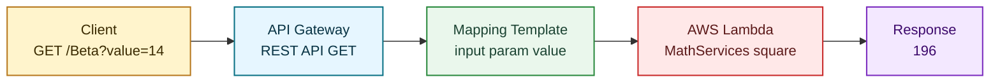

# 🚀 AWS Lambda + API Gateway REST API (Java)

Welcome! This repository is a hands-on lab to learn the fundamentals of **serverless microservices** on AWS using:

- ☕ Java 8
- 📦 Maven
- 🧠 AWS Lambda
- 🌐 Amazon API Gateway (REST API)

The core example is intentionally simple: a Lambda function that returns the **square of an integer**. This keeps the focus on the serverless flow and request mapping mechanics.

---

## ✨ What You Build

You will expose a Java method as a public REST endpoint:

- Input query param: `value`
- Output: `value * value`

Example:

`GET https://<api-id>.execute-api.<region>.amazonaws.com/Beta?value=14` → `196`

---

## 🧱 Project Structure

```text
.
├─ pom.xml
├─ src/main/java/co/edu/escuelaing/services/
│  ├─ MathServices.java
│  ├─ User.java
│  └─ UserServices.java
└─ README.md
```

Main class used in this lab:

```java
package co.edu.escuelaing.services;

public class MathServices {
    public static Integer square(Integer i){
	return i*i;
    }
}
```

---

## ✅ Prerequisites

- AWS account (AWS Academy users can use `LabRole`)
- Java 8+
- Maven 3+
- Permissions to create Lambda functions and API Gateway APIs

Recommended IAM permissions (minimum):

- `lambda:*` (or scoped create/update/invoke permissions)
- `apigateway:*` (or scoped API management permissions)
- `iam:PassRole` for the Lambda execution role

---

## 🔨 1) Build the JAR

Compile and package from the repository root:

```bash
mvn clean package
```

Expected artifact:

- `target/hello-world-1.0-SNAPSHOT.jar`

This is the file uploaded to AWS Lambda.

---

## 🧠 2) Create the Lambda Function

In AWS Console:

1. Open **Lambda**.
2. Click **Create function**.
3. Select **Author from scratch**.
4. Function name: `square` (or similar).
5. Runtime: **Java 8**.
6. Execution role:
   - AWS Academy: use `LabRole`.
   - Otherwise: choose an existing role or let AWS create one.

### Upload code

In **Function code**, upload the JAR generated by Maven.

### Configure handler

Set handler to:

`co.edu.escuelaing.services.MathServices::square`

Then click **Deploy/Save**.

---

## 🧪 3) Test Lambda Directly

Create a test event:

1. Click **Test** → **Configure test event**.
2. Name: `testSquare`.
3. Replace JSON body with a single number:

```json
5
```

4. Save and run **Test**.

Expected result: `25`

Important: in this lab the Lambda receives a **raw number**, not a JSON object.

---

## 🌐 4) Expose Lambda with API Gateway (REST)

### Create API

1. Open **API Gateway**.
2. Click **Get Started**.
3. Choose:
   - **REST API**
   - **New API**
   - Endpoint type: **Regional**
4. API name: `mathServices`.

### Create GET method

1. In resources/actions, click **Create Method**.
2. Select **GET**.
3. Integration type: **Lambda Function**.
4. Lambda function name: `square`.
5. Save.

### Add query parameter

1. Open **Method Request**.
2. Add URL Query String parameter:
   - `value` (required or optional based on your preference)

### Map query parameter to integration request

1. Open **Integration Request**.
2. Under URL Query String Parameters, map:

- Name: `value`
- Mapped from: `method.request.querystring.value`

### Add Mapping Template (critical step)

In **Integration Request** → **Mapping Templates**, add template for `application/json`.

For initial static testing, you can set:

```vtl
5
```

Then for real dynamic behavior, replace with:

```vtl
$input.params("value")
```

This passes only the numeric query value as Lambda input.

---

## 🧪 5) Test from API Gateway Console

Use the built-in **Test** feature for the GET method.

Set query parameter:

- `value = 14`

Expected output: `196`

If `value` is missing or non-numeric, invocation should fail (expected for this simple function signature).

---

## 🚢 6) Deploy API Stage

1. Click **Actions** → **Deploy API**.
2. Choose **[New Stage]**.
3. Stage name: `Beta` (or `dev`, `prod`, etc.).
4. Deploy.

Invoke URL format:

```text
https://<api-id>.execute-api.<region>.amazonaws.com/Beta?value=14
```

---

## 🧭 Request Flow (Mental Model)



```text
Client (GET /?value=14)
	|
	v
API Gateway (extract query param)
	|
	v
VTL Mapping Template -> "14"
	|
	v
Lambda Java Handler square(Integer)
	|
	v
196
```

---

## 🛠 Troubleshooting

### Handler not found

- Verify exact handler:
  - `co.edu.escuelaing.services.MathServices::square`
- Ensure class exists in uploaded JAR.

### `ClassNotFoundException`

- Rebuild with `mvn clean package`.
- Upload latest JAR from `target/`.

### 500 from API Gateway

- Check Lambda CloudWatch logs.
- Confirm mapping template is exactly:

```vtl
$input.params("value")
```

### Input conversion errors

- `square(Integer)` requires a valid integer.
- Avoid sending JSON objects in this lab unless handler signature changes.

---

## 💡 Why This Lab Matters

This lab demonstrates core serverless concepts:

- Event-to-method input mapping
- API Gateway request transformation with VTL
- Java static handlers in Lambda
- Fast REST exposure without managing servers

Once this is clear, moving to JSON payloads and custom POJOs becomes straightforward.

---

## 🧩 About the Extra Classes

This repository also includes:

- `User.java`
- `UserServices.java`

These are useful to evolve the lab into object-based payloads (POJO input/output), which AWS Lambda supports automatically through JSON serialization/deserialization.

---

## 🔒 Cleanup (Avoid Unnecessary Costs)

After finishing the lab:

1. Delete the Lambda function.
2. Delete the API Gateway API.
3. Remove unneeded CloudWatch log groups if desired.

---

## 📘 References

- AWS Lambda Java docs: https://docs.aws.amazon.com/lambda/latest/dg/lambda-java.html
- API Gateway mapping templates: https://docs.aws.amazon.com/apigateway/latest/developerguide/api-gateway-mapping-template-reference.html

---

Built for learning serverless fundamentals with Java on AWS. Happy building! 🎉