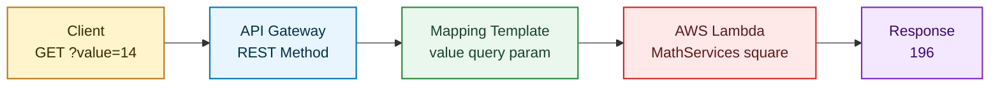

# Serverless REST API with AWS Lambda + Java


## Clean Design, Clear Serverless Flow

This repository provides a hands-on lab to deploy serverless microservices with Java on AWS.

It includes two main handlers:

- `MathServices::square`: receives an integer and returns its square.
- `UserServices::postUser`: receives a user object, keeps the same instance, and sets a status message.

---

## Quick Navigation

1. [Project Snapshot](#project-snapshot)
2. [Flow Architecture](#flow-architecture)
3. [Repository Structure](#repository-structure)
4. [Prerequisites](#prerequisites)
5. [Build and Local Tests](#build-and-local-tests)
6. [Deploy to AWS Lambda](#deploy-to-aws-lambda)
7. [AWS CLI Runbook (No Console)](#aws-cli-runbook-no-console)
8. [Expose with API Gateway](#expose-with-api-gateway)
9. [Invocation Tests](#invocation-tests)
10. [Troubleshooting](#troubleshooting)
11. [References](#references)

---

## Project Snapshot

| Area | Implementation |
| --- | --- |
| Language | Java 8 |
| Build | Maven (`jar`) |
| Testing | JUnit Jupiter 5.10.2 |
| Use Case 1 | Square of an integer |
| Use Case 2 | User creation with confirmation status message |
| HTTP Exposure | Amazon API Gateway (REST) |

---

## Flow Architecture



---

## Repository Structure

```text
aws-lambda-java-rest-api/
|- pom.xml
|- README.md
|- src/
|  |- main/
|  |  |- java/
|  |     |- co/edu/escuelaing/services/
|  |        |- MathServices.java
|  |        |- User.java
|  |        |- UserServices.java
|  |- test/
|     |- java/
|        |- co/edu/escuelaing/services/
|           |- MathServicesTest.java
|           |- UserServicesTest.java
```

---

## Prerequisites

- AWS account with permissions for Lambda, API Gateway, and IAM PassRole.
- Java 8 or later.
- Maven 3 or later.

Suggested minimum permissions:

- `lambda:*` (or a scoped equivalent)
- `apigateway:*` (or a scoped equivalent)
- `iam:PassRole`

---

## Build and Local Tests

Compile, run tests, and package the artifact:

```bash
mvn clean package
```

Expected artifact:

```text
target/hello-world-1.0-SNAPSHOT.jar
```

Included tests:

- `MathServicesTest`: validates positive values, negative values, and zero.
- `UserServicesTest`: validates that the same instance is returned and status is set correctly.

---

## Deploy to AWS Lambda

### Handler 1: Math Operation

1. Create a Lambda function (Java 8).
2. Upload `target/hello-world-1.0-SNAPSHOT.jar`.
3. Configure the handler:

```text
co.edu.escuelaing.services.MathServices::square
```

Suggested test event:

```json
5
```

Expected result: `25`.

### Handler 2: User (Optional API Extension)

Handler:

```text
co.edu.escuelaing.services.UserServices::postUser
```

Suggested test event:

```json
{
  "name": "Alice",
  "email": "alice@example.com"
}
```

The `status` field is populated automatically with a confirmation message.

---

## AWS CLI Runbook (No Console)

The following workflow is fully idempotent: you can run it multiple times without failing when resources already exist.

It handles:

- Lambda create vs. update.
- API lookup by name vs. create.
- Existing GET method and integration (safe replace).
- Existing Lambda permission statement (safe replace).

### 1. Build the project

```bash
mvn clean package
```

### 2. Set environment variables

```bash
export AWS_REGION=us-east-1
export FUNCTION_NAME=square
export STAGE_NAME=Beta
export ROLE_ARN=arn:aws:iam::<account-id>:role/<lambda-execution-role>
export JAR_PATH=target/hello-world-1.0-SNAPSHOT.jar
```

PowerShell equivalent:

```powershell
$env:AWS_REGION = "us-east-1"
$env:FUNCTION_NAME = "square"
$env:STAGE_NAME = "Beta"
$env:ROLE_ARN = "arn:aws:iam::<account-id>:role/<lambda-execution-role>"
$env:JAR_PATH = "target/hello-world-1.0-SNAPSHOT.jar"
```

### 3. Run idempotent provisioning script (Bash)

```bash
set -euo pipefail

# 3.1 Account and Lambda bootstrap
ACCOUNT_ID=$(aws sts get-caller-identity --query Account --output text)

if aws lambda get-function --function-name "$FUNCTION_NAME" >/dev/null 2>&1; then
    echo "Updating existing Lambda: $FUNCTION_NAME"
    aws lambda update-function-code \
        --function-name "$FUNCTION_NAME" \
        --zip-file "fileb://$JAR_PATH" >/dev/null
else
    echo "Creating Lambda: $FUNCTION_NAME"
    aws lambda create-function \
        --function-name "$FUNCTION_NAME" \
        --runtime java8 \
        --role "$ROLE_ARN" \
        --handler co.edu.escuelaing.services.MathServices::square \
        --zip-file "fileb://$JAR_PATH" >/dev/null
fi

# 3.2 Reuse existing API by name, or create it
API_ID=$(aws apigateway get-rest-apis \
    --query "items[?name=='mathServices'].id | [0]" \
    --output text)

if [ "$API_ID" = "None" ] || [ -z "$API_ID" ]; then
    echo "Creating REST API: mathServices"
    API_ID=$(aws apigateway create-rest-api \
        --name mathServices \
        --endpoint-configuration types=REGIONAL \
        --query id \
        --output text)
else
    echo "Reusing REST API: $API_ID"
fi

ROOT_RESOURCE_ID=$(aws apigateway get-resources \
    --rest-api-id "$API_ID" \
    --query "items[?path=='/'].id | [0]" \
    --output text)

# 3.3 Ensure GET method exists with query parameter
if aws apigateway get-method \
    --rest-api-id "$API_ID" \
    --resource-id "$ROOT_RESOURCE_ID" \
    --http-method GET >/dev/null 2>&1; then
    echo "GET method already exists. Updating request parameter requirement."
    aws apigateway update-method \
        --rest-api-id "$API_ID" \
        --resource-id "$ROOT_RESOURCE_ID" \
        --http-method GET \
        --patch-operations op=replace,path=/requestParameters/method.request.querystring.value,value=true >/dev/null 2>&1 \
    || aws apigateway update-method \
        --rest-api-id "$API_ID" \
        --resource-id "$ROOT_RESOURCE_ID" \
        --http-method GET \
        --patch-operations op=add,path=/requestParameters/method.request.querystring.value,value=true >/dev/null
else
    echo "Creating GET method on root resource."
    aws apigateway put-method \
        --rest-api-id "$API_ID" \
        --resource-id "$ROOT_RESOURCE_ID" \
        --http-method GET \
        --authorization-type NONE \
        --request-parameters method.request.querystring.value=true >/dev/null
fi

# 3.4 Upsert Lambda integration and request template
LAMBDA_ARN="arn:aws:lambda:${AWS_REGION}:${ACCOUNT_ID}:function:${FUNCTION_NAME}"
APIGW_URI="arn:aws:apigateway:${AWS_REGION}:lambda:path/2015-03-31/functions/${LAMBDA_ARN}/invocations"

aws apigateway put-integration \
    --rest-api-id "$API_ID" \
    --resource-id "$ROOT_RESOURCE_ID" \
    --http-method GET \
    --type AWS \
    --integration-http-method POST \
    --uri "$APIGW_URI" \
    --passthrough-behavior NEVER \
    --request-templates '{"application/json":"$input.params(\"value\")"}' >/dev/null

# 3.5 Ensure method/integration responses exist
aws apigateway put-method-response \
    --rest-api-id "$API_ID" \
    --resource-id "$ROOT_RESOURCE_ID" \
    --http-method GET \
    --status-code 200 >/dev/null 2>&1 || true

aws apigateway put-integration-response \
    --rest-api-id "$API_ID" \
    --resource-id "$ROOT_RESOURCE_ID" \
    --http-method GET \
    --status-code 200 \
    --response-templates '{"application/json":"$input.body"}' >/dev/null 2>&1 || true

# 3.6 Replace Lambda invoke permission safely
STATEMENT_ID="apigateway-invoke-${API_ID}"
aws lambda remove-permission \
    --function-name "$FUNCTION_NAME" \
    --statement-id "$STATEMENT_ID" >/dev/null 2>&1 || true

aws lambda add-permission \
    --function-name "$FUNCTION_NAME" \
    --statement-id "$STATEMENT_ID" \
    --action lambda:InvokeFunction \
    --principal apigateway.amazonaws.com \
    --source-arn "arn:aws:execute-api:${AWS_REGION}:${ACCOUNT_ID}:${API_ID}/*/GET/" >/dev/null

# 3.7 Deploy stage (create new deployment revision each run)
aws apigateway create-deployment \
    --rest-api-id "$API_ID" \
    --stage-name "$STAGE_NAME" >/dev/null

INVOKE_URL="https://${API_ID}.execute-api.${AWS_REGION}.amazonaws.com/${STAGE_NAME}"
echo "Invoke URL: ${INVOKE_URL}?value=14"

# Optional smoke test
curl "${INVOKE_URL}?value=14"
echo
```

### 4. Optional: concise one-liner smoke test

```bash
curl "${INVOKE_URL}?value=14"
```

Expected output:

```text
196
```

---

## Expose with API Gateway

For `MathServices::square` (REST API):

1. Create a REST API (Regional).
2. Create a `GET` method and integrate it with Lambda.
3. Add query param `value` in Method Request.
4. In Integration Request, map:

- Name: `value`
- Mapped from: `method.request.querystring.value`

5. Add Mapping Template `application/json`:

```vtl
$input.params("value")
```

6. Deploy a stage (for example: `Beta`).

Invocation format:

```text
https://<api-id>.execute-api.<region>.amazonaws.com/Beta?value=14
```

---

## Invocation Tests

Recommended validation cases in API Gateway test console or any HTTP client:

| Case | Request | Expected Result |
| --- | --- | --- |
| Valid square | `GET .../Beta?value=14` | `196` |
| Zero | `GET .../Beta?value=0` | `0` |
| Negative integer | `GET .../Beta?value=-4` | `16` |
| Missing parameter | `GET .../Beta` | Expected conversion error |

---

## Troubleshooting

### Handler not found

- Validate the exact handler signature.
- Confirm the uploaded JAR is the latest build.

### ClassNotFoundException

- Run `mvn clean package` again.
- Re-upload the artifact from `target/`.

### API Gateway 500 Error

- Check CloudWatch logs.
- Confirm Mapping Template is exactly:

```vtl
$input.params("value")
```

### Input Conversion Error

- `square(Integer)` requires a valid integer as input.
- Do not send a JSON object to this specific handler.

---

## References

- AWS Lambda Java: https://docs.aws.amazon.com/lambda/latest/dg/lambda-java.html
- API Gateway Mapping Templates: https://docs.aws.amazon.com/apigateway/latest/developerguide/api-gateway-mapping-template-reference.html

---

Project focused on practical learning for Java, Lambda, and API Gateway integration in a modern serverless flow.